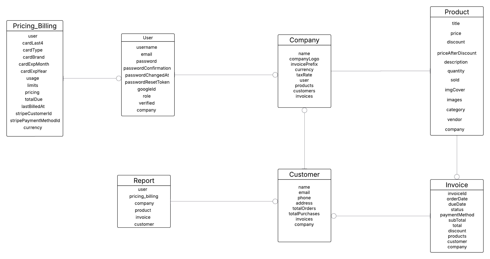

# PayFlow

PayFlow is a lightweight yet powerful Customer Relationship Management (CRM) and Billing Platform crafted to help startups, freelancers, and small businesses eliminate operational chaos.
With integrated AI insights and seamless payment handling — PayFlow makes business management smarter and simpler.

---

## Presented By:

```bash
- Bassem Hazem
- Seraj Eldeen
- Amira Ahmed
- Alaa Nabil
- Marwa Hassan
```

---

## Features:

- **AI Assistant** — Smart assistant that helps automate your business decisions.
- **Smart Invoices** — Automatically generate and send invoices to clients.
- **Smart Products** — Auto-generate product details and pricing.
- **Smart Customers** —Manage and auto-create customer profiles.
- **Smart Billing** — Handle automated billing with Stripe integration.
- **Smart Payments** — Track and confirm payments in real time.
- **Smart Reports** — Auto-generate financial and activity reports.
- **Arabic Support** — Multi-language support for Arabic and English.
- **Admin Panel** — Manage users, see users activity, and permissions.
- **User Dashboard** — Personalized dashboard for quick insights.
- **Dark Mode** — A smooth and elegant dark interface option.
- **Stripe Integration** — Secure and seamless online payment processing.

---

# Technologies Used:

```bash
## Backend:
- Node.js
- Express.js
- JWT (Authentication)
- Bcrypt (Password Encryption)
## Frontend:
- React.js
- Vite
- Tailwind CSS

## Database:
- MongoDB

## Payments:
- Stripe

## Deployment:
- Vercel
```

---

# Architecture Overview

- RESTful API design
- Token-based authentication (JWT)
- Modular and scalable folder structure
- Integrated AI-based automation layer

# ERD Diagram:



## Screenshots:

| Page                  | Preview                                    |
| --------------------- | ------------------------------------------ |
| **Login**             |                |
| **Dashboard**         |        |
| **Invoices**          |          |
| **Products**          |          |
| **Customers**         |        |
| **Pricing & Billing** |    |
| **Reports**           |            |
| **AI Assistant**      |  |
| **Admin Panel**       |    |

---
